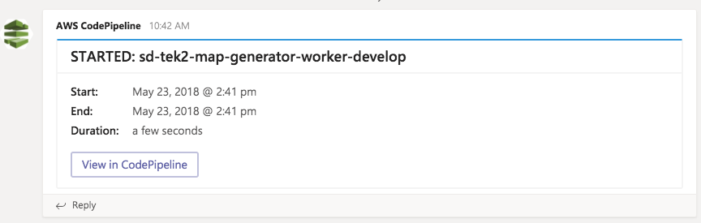
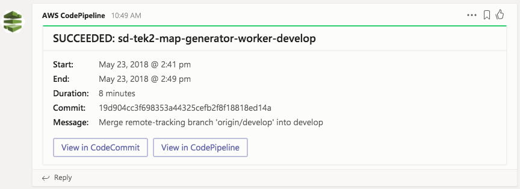

## Lambda CodePipeline Microsoft Teams Notifications
Lambda function to handle CodePipeline CloudWatch events and send a notification via Microsoft Teams. The function will send a notification to the Teams channel webhook for all CodePipeline Pipeline Execution State Change - which is the events for the whole pipeline. So for things like started, succeeded, and failed.




### Deployment
Requires Terraform to be installed.

1. Change permissions of deployment bash script `chmod +x deploy.sh`
2. Run `./deploy.sh` which will prompt you for the following variables:
    - profile = AWS CLI profile
    - region = AWS Region
    - teams_webhook_url = URL for Microsoft Teams webhook

### What's Going On:
- Zips up the NodeJS code
- Terraform creates:
    - IAM role for Lambda function
    - Lambda function with code (lambda.zip)
    - CloudWatch CodePipeline event

### Tips
- You can update the `deploy.sh` script to auto assign the variables so you're not prompted each time. It would look something like this:

    ```bash
    terraform apply \
        -var "profile=develop" \
        -var "region=eu-west-1" \
        -var "teams_webhook_url=https://..."
    ```
